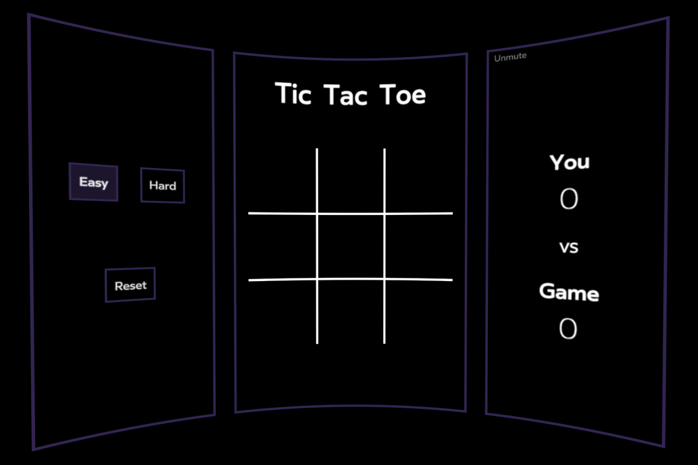

# VR Tic Tac Toe

A simple Tic Tac Toe game built for Virtual Reality (Submission for **2019 Developer Circles Community Challenge**)

## Inspiration

The idea was to take a simple game which is known to everyone and bring it to the world of Virtual Reality. VR helps in creating an immersive environment which elevates even a simple game to an exciting experience, so the goal was to create a VR mini-game which was fun and relaxing to play.

## What it does

It is a Single-player Tic Tac Toe game built for VR where the player plays against the game. There are two difficulty modes for the player - Easy and Hard. The game is set to Easy mode by default but the player can switch modes at any stage of the game. In order to create an immersive experience, the game has background music which can be muted or unmuted by the player.

## How I built it

I built it using React 360 and the Game AI uses the [Minimax Algorithm](https://en.wikipedia.org/wiki/Minimax) for Hard mode.

## Challenges I ran into

The major challenge was to understand React360 project structure which is very different from a standard React project. Understanding Surfaces in order to choose the best layout for the game was another challenge. Another difficulty was to get familiar with CSS Flexbox since React 360's View uses flexbox for the layout. Also, styling in React 360 is very different from writing simple CSS.

## Accomplishments that I'm proud of

I built 90% of the game in the span of 3 days. This involved designing the game, creating Tic Tac Toe logic and also writing the Minimax algorithm for the Game AI.

## What I learned

I learned using React 360 and also that building VR apps is much easier with React 360. I also learned the potential of Virtual Reality since it can create an experience which can't be delivered via any other mean.

## What's next for VR Tic Tac Toe

The initial plan was to build two-player Tic Tac Toe using WebSockets but there were some issues which could not be resolved. If React 360 is able to support text input or use of dynamic links then the second version of this project would be building a Multiplayer VR Tic Tac Toe.

Link: [Here](https://sleepy-almeida-d59ef4.netlify.com/)  
Music: [Royalty Free Music from Bensound](https://www.bensound.com/royalty-free-music/track/dreams-chill-out)
